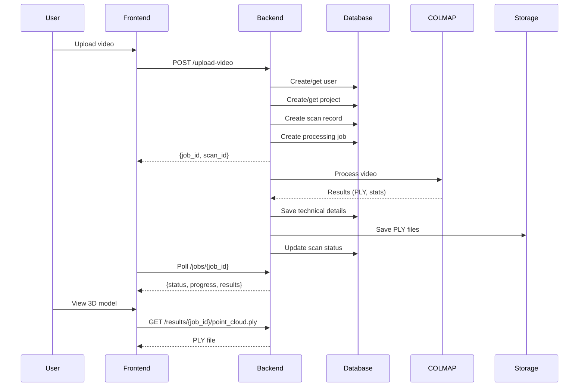

# 🗄️ Database Setup & Integration Guide

## Overview

The COLMAP MVP uses **SQLite** as the database to store:
- 👤 **Users**: Authentication and profile data
- 📁 **Projects**: User projects with metadata
- 📹 **Scans**: 3D reconstruction scans from videos
- 🔧 **Technical Details**: COLMAP processing results (points, cameras, etc.)
- ⚙️ **Processing Jobs**: Background job tracking

---

## 📊 Database Schema

### Users Table
```sql
CREATE TABLE users (
    id TEXT PRIMARY KEY,              -- UUID
    email TEXT UNIQUE NOT NULL,       -- User email (used for login)
    name TEXT,                        -- Display name
    created_at TIMESTAMP              -- Account creation time
)
```

### Projects Table
```sql
CREATE TABLE projects (
    id TEXT PRIMARY KEY,              -- UUID
    user_id TEXT NOT NULL,            -- Foreign key to users
    name TEXT NOT NULL,               -- Project name
    description TEXT,                 -- Project description
    location TEXT,                    -- Physical location
    space_type TEXT,                  -- indoor/outdoor/mixed
    project_type TEXT,                -- architecture/product/landscape
    status TEXT DEFAULT 'active',     -- active/archived
    created_at TIMESTAMP,
    updated_at TIMESTAMP,
    FOREIGN KEY (user_id) REFERENCES users (id)
)
```

### Scans Table
```sql
CREATE TABLE scans (
    id TEXT PRIMARY KEY,              -- UUID
    project_id TEXT NOT NULL,         -- Foreign key to projects
    name TEXT NOT NULL,               -- Scan name
    status TEXT DEFAULT 'pending',    -- pending/processing/completed/failed
    video_filename TEXT,              -- Original video filename
    video_size INTEGER,               -- Video size in bytes
    video_duration REAL,              -- Video duration in seconds
    processing_quality TEXT,          -- low/medium/high
    created_at TIMESTAMP,
    updated_at TIMESTAMP,
    FOREIGN KEY (project_id) REFERENCES projects (id)
)
```

### Scan Technical Details Table
```sql
CREATE TABLE scan_technical_details (
    scan_id TEXT PRIMARY KEY,         -- Foreign key to scans
    point_count INTEGER,              -- Number of 3D points
    camera_count INTEGER,             -- Number of cameras/frames
    feature_count INTEGER,            -- Total SIFT features
    processing_time_seconds REAL,     -- Total processing time
    resolution TEXT,                  -- e.g., "1920x1080"
    file_size_bytes INTEGER,          -- Output file size
    reconstruction_error REAL,        -- COLMAP reprojection error
    coverage_percentage REAL,         -- Area coverage %
    processing_stages TEXT,           -- JSON: [stage1, stage2, ...]
    results TEXT,                     -- JSON: {point_cloud_url, ...}
    created_at TIMESTAMP,
    FOREIGN KEY (scan_id) REFERENCES scans (id)
)
```

### Processing Jobs Table
```sql
CREATE TABLE processing_jobs (
    job_id TEXT PRIMARY KEY,          -- UUID
    scan_id TEXT NOT NULL,            -- Foreign key to scans
    status TEXT DEFAULT 'pending',    -- pending/processing/completed/failed
    progress INTEGER DEFAULT 0,       -- 0-100%
    current_stage TEXT,               -- "Feature Extraction", etc.
    message TEXT,                     -- Status message
    started_at TIMESTAMP,
    completed_at TIMESTAMP,
    FOREIGN KEY (scan_id) REFERENCES scans (id)
)
```

---

## 🔧 Configuration

### Environment Variables

Set in Northflank:

```bash
# Database Configuration (CRITICAL)
DATABASE_PATH=/app/data/colmap_app.db    # Must be in persistent volume!

# Storage Configuration
STORAGE_DIR=/app/data/results            # Where PLY/mesh files are saved
CACHE_DIR=/app/cache                     # Temporary processing files
```

### Northflank Persistent Volumes

**⚠️ IMPORTANT**: The database must be on a persistent volume, otherwise data will be lost on pod restart.

```json
{
  "volumes": [
    {
      "name": "data",
      "path": "/app/data",
      "size": "20GB",
      "type": "persistent"
    }
  ]
}
```

---

## 🚀 API Endpoints

### Database Management

#### GET `/database/status`
Check database connectivity and table counts.

**Response**:
```json
{
  "status": "connected",
  "database_path": "/app/data/colmap_app.db",
  "database_size_mb": 2.45,
  "database_exists": true,
  "tables": {
    "users": 5,
    "projects": 12,
    "scans": 34,
    "processing_jobs": 45
  },
  "timestamp": "2025-10-14T12:00:00"
}
```

#### POST `/database/init-test-data`
Initialize demo user and project (for testing).

**Response**:
```json
{
  "status": "success",
  "message": "Test data initialized",
  "user_id": "uuid-here",
  "project_id": "uuid-here",
  "test_email": "test@colmap.app"
}
```

### User Management

#### POST `/users`
Create a new user.

**Request**:
```json
{
  "email": "user@example.com",
  "name": "John Doe"
}
```

**Response**:
```json
{
  "id": "uuid-here",
  "email": "user@example.com",
  "name": "John Doe",
  "created_at": "2025-10-14T12:00:00"
}
```

#### GET `/users/{email}`
Get user by email.

### Project Management

#### POST `/projects`
Create a new project.

**Request**:
```json
{
  "user_email": "user@example.com",
  "name": "My Building Project",
  "description": "3D model of my house",
  "location": "San Francisco, CA",
  "space_type": "architecture",
  "project_type": "building"
}
```

#### GET `/projects/{email}`
Get all projects for a user.

**Response**:
```json
{
  "user_email": "user@example.com",
  "projects": [
    {
      "id": "uuid",
      "name": "My Building Project",
      "description": "...",
      "scan_count": 3,
      "created_at": "2025-10-14T12:00:00"
    }
  ]
}
```

### Scan Management

#### POST `/upload-video`
Upload video and create a scan.

**Form Data**:
- `video`: Video file (MP4 recommended)
- `project_id`: UUID of project
- `scan_name`: Name for the scan
- `quality`: "low" | "medium" | "high"
- `user_email`: User's email

**Response**:
```json
{
  "job_id": "uuid-here",
  "scan_id": "uuid-here",
  "status": "pending",
  "message": "Video uploaded successfully. Processing will begin shortly."
}
```

#### GET `/scans/{project_id}`
Get all scans for a project.

#### GET `/scans/{scan_id}/details`
Get detailed scan results including technical data.

**Response**:
```json
{
  "id": "uuid",
  "name": "Scan 001",
  "status": "completed",
  "project_name": "My Building Project",
  "point_count": 1543256,
  "camera_count": 45,
  "processing_time_seconds": 324.5,
  "results": {
    "point_cloud_url": "/results/uuid/point_cloud.ply",
    "sparse_model_url": "/results/uuid/sparse.zip",
    "images_url": "/results/uuid/images.zip"
  }
}
```

---

## 🧪 Testing the Database

### Method 1: Automated Script

```bash
chmod +x test-database.sh
./test-database.sh
```

### Method 2: Manual Testing

```bash
# 1. Check database status
curl https://YOUR_BACKEND_URL/database/status | jq

# 2. Initialize test data
curl -X POST https://YOUR_BACKEND_URL/database/init-test-data | jq

# 3. Create a user
curl -X POST https://YOUR_BACKEND_URL/users \
  -H "Content-Type: application/json" \
  -d '{"email": "test@example.com", "name": "Test User"}' | jq

# 4. Create a project
curl -X POST https://YOUR_BACKEND_URL/projects \
  -H "Content-Type: application/json" \
  -d '{
    "user_email": "test@example.com",
    "name": "Test Project",
    "description": "My first project"
  }' | jq

# 5. Get user projects
curl https://YOUR_BACKEND_URL/projects/test@example.com | jq
```

---

## 🔍 Verifying Database Persistence

### Check Database Location

```bash
curl https://YOUR_BACKEND_URL/health | jq '.database_path'
```

**Expected**: `/app/data/colmap_app.db` ✅  
**Bad**: `/tmp/colmap_app.db` ❌ (ephemeral, will be lost!)

### Check Database Exists

```bash
curl https://YOUR_BACKEND_URL/health | jq '.database_exists'
```

**Expected**: `true` ✅

### Verify Data After Restart

1. Create a test project
2. Restart the Northflank service
3. Query the project again
4. **It should still exist** ✅

If data is lost after restart, the database is not on a persistent volume!

---

## 🛠️ Database Workflow

### Complete User Upload Flow



### Database Operations per Stage

| Stage | Database Operations |
|-------|-------------------|
| **Upload** | `create_user()`, `get_project()`, `create_scan()` |
| **Processing** | Update job status, progress |
| **Complete** | `save_scan_technical_details()`, update scan status |
| **View** | `get_scan_details()`, retrieve results |

---

## 📈 Database Performance

### SQLite Optimization

The database is configured with:
- **WAL mode**: Write-Ahead Logging for better concurrency
- **Row factory**: Dictionary-like access to rows
- **Foreign keys**: Referential integrity
- **Indexes**: Fast lookups by email, project_id, scan_id

### Expected Database Size

| Usage | Size |
|-------|------|
| 10 users, 50 projects | ~1 MB |
| 100 scans | ~5 MB |
| 1000 scans with technical details | ~50 MB |

### Backup Strategy

**Recommended**: Set up automatic backups of `/app/data` volume in Northflank.

---

## 🐛 Troubleshooting

### Issue 1: Database Not Found

**Symptom**: `"database_exists": false`

**Solutions**:
1. Check `DATABASE_PATH` environment variable
2. Verify persistent volume is mounted at `/app/data`
3. Restart service to trigger database initialization

### Issue 2: Data Lost After Restart

**Symptom**: Projects disappear after pod restart

**Cause**: Database in `/tmp` (ephemeral storage)

**Solution**: 
1. Set `DATABASE_PATH=/app/data/colmap_app.db`
2. Mount persistent volume at `/app/data`
3. Verify with `/database/status` endpoint

### Issue 3: Permission Denied

**Symptom**: `sqlite3.OperationalError: unable to open database file`

**Solution**:
```dockerfile
RUN mkdir -p /app/data && chmod 755 /app/data
```

### Issue 4: Foreign Key Constraint

**Symptom**: `FOREIGN KEY constraint failed`

**Cause**: Trying to create scan without valid project_id

**Solution**: Always create/get project before creating scan

---

## 🎯 Production Checklist

- [ ] `DATABASE_PATH` set to `/app/data/colmap_app.db`
- [ ] Persistent volume mounted at `/app/data` (20GB+)
- [ ] Database status endpoint returns `"status": "connected"`
- [ ] Test data persists after service restart
- [ ] Backup strategy in place
- [ ] Monitoring for database size growth
- [ ] CORS configured for frontend domain
- [ ] Error logging configured

---

## 📚 Related Documentation

- [Integration Guide](INTEGRATION_GUIDE.md) - Full pipeline integration
- [Deployment Guide](DEPLOY_TO_NORTHFLANK.md) - Northflank setup
- [COLMAP Documentation](https://colmap.github.io/) - Official COLMAP docs

---

## 🚀 Quick Start

```bash
# 1. Test database connectivity
curl https://YOUR_BACKEND_URL/database/status

# 2. Initialize demo data
curl -X POST https://YOUR_BACKEND_URL/database/init-test-data

# 3. Verify data exists
curl https://YOUR_BACKEND_URL/projects/test@colmap.app

# 4. Upload a test video
curl -X POST https://YOUR_BACKEND_URL/upload-video \
  -F "video=@test.mp4" \
  -F "project_id=PROJECT_ID_FROM_STEP_2" \
  -F "scan_name=Test Scan" \
  -F "quality=low" \
  -F "user_email=test@colmap.app"
```

---

**Your database is ready! 🎉** Now you can track all user uploads, projects, and 3D reconstruction results.

Reference: [COLMAP Official Documentation](https://colmap.github.io/)

